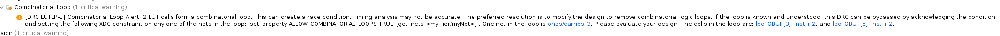

# Why Do We Compliment Two Anyway?

In a previous lab, we designed adder circuitry to sum two numbers together. These circuits even became so advanced as to be able to chain effectively indefinitely to sum numbers of arbitrary binary width.

This begs an interesting question... How do we subtract? Other than the light spoiler in the title of this video, you may have heard about Two's Compliment. In this lab, we are going to work our way to Two's Compliment to discover why it is so important and powerful as a concept within computer science.

## Starting from the beginning

Let's go ahead and just start from the naive solution. We have an adder, let's build a binary subtractor! We can easily equate this to regular subtraction as learned in grade school:

```txt
 BA
 10
- 1
==>
A: 0 - 1 = 9, borrow 1
B: 1 - 1 (from the borrow) = 0
==>
 09
```

Just the same in binary:

```txt
 DCBA
 0100 (4)
-0001 (1)
==>
A: 0 - 1 = 1, borrow 1
B: 0 - 1 (from the borrow) = 1, borrow 1
C: 1 - 1 (from the borrow) = 0
D: 0 - 0 = 0
==>
 0011 (3)
```

As we can see, the borrow, just like the carry, ripples as far as it needs to until we find a place to pull the one from. Just for sanity's sake, however, let's see if this actually is the correct subtraction result. `0100` is `(0 * 1 + 0 * 2 + 1 * 4 + 0 * 8) = 4` and `0001 = ...1`. We would expect `4 - 1 = 3`, well `0011` is `(1 * 1 + 1 * 2 + 0 * 4 + 0 * 8) = 3`! All good.

So, from the above equations we have seen a basic set of rules emerge. From these, we can build a truth table that describes a single bit subtraction, just as we did for the half adder. The truth table for `A - B` is shown below:

| A   | B   | Y   | Borrow |
| --- | --- | --- | ------ |
| 0   | 0   | 0   | 0      |
| 0   | 1   | 1   | 1      |
| 1   | 0   | 1   | 0      |
| 1   | 1   | 0   | 0      |

Let's compare this with the truth table for the half adder from the previous lab:

| A   | B   | Y   | Carry |
| --- | --- | --- | ----- |
| 0   | 0   | 0   | 0     |
| 0   | 1   | 1   | 0     |
| 1   | 0   | 1   | 0     |
| 1   | 1   | 0   | 1     |

Wow, that... is suspiciously similar. We can clearly see that the only difference in the two truth tables is the Carry/Borrow bit.

**DELIVERABLE**: In the file `half_sub.v`, implement the equations for the half subtractor truth table above. Use the half adder from previous labs for inspiration. You can also generate the two input KMaps for each of Y and Borrow to derive the equations if you would like. Use the following table for your inputs and outputs in your `top.v`. Run the simulation to make sure your adder follows the truth table before you proceed.

| Signal | Purpose              | Direction |
| ------ | -------------------- | --------- |
| sw[0]  | A of subtractor      | IN        |
| sw[1]  | B of subtractor      | IN        |
| led[0] | Y of subtractor      | OUT       |
| led[1] | Borrow of subtractor | OUT       |

**QUESTION**: How does this differ from the adder circuit? What is a notable difference in the logic equation?

## But it isn't that simple

Cool! Computers can subtract now. Except.... we have a problem. Let's look at the following subtraction as run through our system:

```txt
 DCBA
 0000
-0001
==>
A: 0 - 1 = 1, borrow 1
B: 0 - 1 (from the borrow) = 1, borrow 1
C: 0 - 1 (from the borrow) = 1, borrow 1
D: 0 - 1 (from the borrow) = 1, borrow 1
 1111
```

Nice! Obviously `0 - 1 = 15`! Wait, no. That's probably not right. We have now run face first into the problem of negative numbers. How do we represent them in binary? We can't just write a `-` in front of our numbers if they're negative. Again, to set the ground work for the right answer, let's go through a naive solution first.

## Signed Integers

So far throughout this lab, we've treated all integers as "unsigned", that is they can only be positive. We now need to expand our understanding of numbers to "signed" integers. You may have seen/experienced this type of thing programming languages such as C or Java, where there are separate data types for signed and unsigned integers.

Obviously, signed integers must keep track of their sign *somehow* or they would be... well... unsigned integers. This puts an extra impetus on the binary representation somehow. One of the bits in our number has to be what we use to keep track of things. For a naive solution, let's just use the most significant bit as if it were a `+/-` sign: `1 = + | 0 = -`. Now, we can easily represent a full gamut of signed integers:

```txt
+0 = 10000
-0 = 00000

+8 = 11000
-8 = 01000

+1 = 10001
-1 = 00001
```

Cool, this is progress! You can tell just by looking at the most significant bit of each number if it is negative or positive. However, this comes at a cost. If we have 8 bit wide numbers, we can no longer represent `0 -> 255`, but instead `+0 -> +127` and `-0 -> -127` since one of our eight bits is *only* for sign information.

Let's run another subtraction experiment to see how this work:

```txt
EDCBA
10010 (+2)
11000 (+8)
==>
A: 0 - 0 = 0
B: 1 - 0 = 1
C: 0 - 0 = 0
D: 0 - 1 = 1, borrow 1
E: 1 - 1 - 1 (from the borrow) = 1
==>
11010 == +10
```

Well, shoot. `+10 != -6`, at least most of the time. Obviously our number representation system is incompatible with this subtractor solution. For that matter... how can we do additions with this system? After all `+5 + -2 = 3`. If we were to try that with our full adder from the previous lab, it would *not work*. I won't even run through the example to prove it, Just Trust Me.

This number representation system we've come up with needs a ton of supporting circuitry to work. We would need to bring a sign bit check int our adder to invoke special subtraction logic, we would need to handle the rollover condition properly for going from positive to negative in a subtraction, and more myriad issues.

## So... that didn't work, what now?

Let's take a different approach. Let's keep the whole "most significant bit is sign bit" idea, but flip it. How about we leave well enough alone for the positive numbers. MSB is `0 = + | 1 = -`. This lets us just keep `0001 = 1, 0010 = 2, ...` and so on. So... how do we count negative numbers? If we just do the same thing we did above and say `1001 = -1` we will be just as in trouble as we were before. So, again, let's flip the script.

Let's say that negative numbers are represented as the bitwise inversion of their positive counterpart -- also known as compliment. This means:

```txt
0001 = 1
1110 = -1

0010 = 2
1101 = -2
...
```

Alright, let's try our trick with `0 - 1`:

```txt
 DCBA
 0000
-0001
==>
A: 0 - 1 = 1, borrow 1
B: 0 - 1 (from the borrow) = 1, borrow 1
C: 0 - 1 (from the borrow) = 1, borrow 1
D: 0 - 1 (from the borrow) = 1, borrow 1 (**)
==>
 1111
```

OK... so this produced the same answer, obviously, but what does this mean? Well, since we have decided that negative numbers are the bitwise inversion of their positive compliments, we can say that `1111 = -0`. Oh... negative zero. That's not -1 but it sure is closer than 15.

But... what if we have a way out? I've marked the final borrow up above with two asterisks. If we simply wire this up to the borrow input of the LSB subtractor, creating something called an **end-around borrow** this might just work:

```txt
 DCBA
 0000
-0001
==>
A: 0 - 1 - 1 (**) = 0, borrow 1 <----------------┐
B: 0 - 1 (from the borrow) = 1, borrow 1         |
C: 0 - 1 (from the borrow) = 1, borrow 1         | End around borrow
D: 0 - 1 (from the borrow) = 1, borrow 1 (**) ---┘
==>
 1110
```

AHA! That's it. `1110` is `-1`. With this end around borrow, we successfully can represent negative numbers and construct a working subtraction circuit. It has just one final test to pass -- can we do addition with our number format with a regular adder?

```txt
 DCBA
 1110 (-1)
+0010 (+2)
==>
A: 0 + 0 = 0
B: 1 + 1 = 0, carry 1
C: 1 + 1 (from the carry) = 0, carry 1
D: 1 + 1 (from the carry) = 0, carry 1 (**)
==>
 0000 (+0)
```

Oh... heck. This is `0000 = +0` not `0001 = +1`. However, the astute among you may have noticed that there is yet another carry marked with a double asterisk. Correct! If we do what is called an **end-around carry** we will now get the right answer:

```txt
 DCBA
 1110 (-1)
+0010 (+2)
==>
A: 0 + 0 + 1(**) = 1 <-------------------------┐
B: 1 + 1 = 0, carry 1                          |
C: 1 + 1 (from the carry) = 0, carry 1         | End around carry
D: 1 + 1 (from the carry) = 0, carry 1 (**) ---┘
==>
 0001
```

Excellent! We now have a number representation that can use completely regular adders and subtractors to keep track of all signed integer arithmetic. We could implement a full computer around this! We have used this method to split our unsigned integer space into a signed one, from `+0 -> +7` and `-0 -> -7`. Notice this system just did `2 - 1`! It can subtract with an adder, given we can just find the compliment for any input number to do subtraction.

This system we have discovered together is called **Ones' Compliment**. It suffers from a number of problems (pun intended) including two we have already faced. We have two zeros (+0 and -0) as well as requiring the end-around borrows and carries. For reasons we will get into in later labs, that end-around problem causes absolute havoc with computer systems and makes them significantly more slow than they would otherwise be. However, it has some notable advantages as well. We don't need to implement a standalone subtractor circuit, as we can just add the negative version of a number to simulate subtraction, and getting the compliment of any number is as simple as inverting all of its bits.

**DELIVERABLE**: In the file `ones_compliment.v` implement a block that does ones compliment addition between two four bit numbers using the IO table below:

| Signal | Purpose                         | Direction |
| ------ | ------------------------------- | --------- |
| sw[2]  | Number A bit 0                  | IN        |
| sw[3]  | Number A bit 1                  | IN        |
| sw[4]  | Number A bit 2                  | IN        |
| sw[5]  | Number A bit 3                  | IN        |
| sw[6]  | Number B bit 0                  | IN        |
| sw[7]  | Number B bit 1                  | IN        |
| sw[8]  | Number B bit 2                  | IN        |
| sw[9]  | Number B bit 3                  | IN        |
| led[2] | Ones' Compliment addition bit 0 | OUT       |
| led[3] | Ones' Compliment addition bit 1 | OUT       |
| led[4] | Ones' Compliment addition bit 2 | OUT       |
| led[5] | Ones' Compliment addition bit 3 | OUT       |

**HINT**: Use the `full_adder.v` from week 4.
**BIGGER WAY BIGGER HINT**: Please read [this](./help_on_ones.md) because there is a wrong way to do this that will still work. Alternatively, if you have seen this critical warning in your output and/or have run into the `test.py` executing forever, you may want to read [this](./help_on_ones.md):



**Question**: What do you think makes the end-around carry so complicated and unfit for use in modern computers? Think about this: the way you implemented the adder, with four separate `full_adder` instances, is what is called a **ripple** carry adder.

To additionally cause you to think, consider the case where we want to add the following numbers:

```txt
 1111 (-0)
+0010 (2)
```

If you are confused, you may want to read [this](./help_on_ones.md).

## Ones plus ones compliment

In the previous section we established that Ones' Compliment is a workable method for tracking signed integers and using regular adding circuitry to do addition and subtraction. But of course this lab asks why we compliment Twos, so let's find out together.

Referring back to our first problem example:

```txt
 DCBA
 0000
-0001
==>
A: 0 - 1 = 1, borrow 1
B: 0 - 1 (from the borrow) = 1, borrow 1
C: 0 - 1 (from the borrow) = 1, borrow 1
D: 0 - 1 (from the borrow) = 1, borrow 1
==>
 1111
```

What if we just... say that `1111 = -1`? This is basically the same operation as we saw in One's Compliment except that we just skip past the end-around borrow. How would this system work? It passes at least one sniff check -- we can run our result back through a completely normal adder to reverse things:

```txt
 DCBA
 1111 (-1)
+0001 (+1)
==>
A: 1 + 1 = 0, carry 1
B: 1 + 1 (from the carry) = 0, carry 1
C: 1 + 1 (from the carry) = 0, carry 1
D: 1 + 1 (from the carry) = 0, carry 1
==>
 0000 (0)
```

The entire above operation can be done with an utterly standard adder, making our `-1 + 1 = 0` test work. It also looks the same as the Ones' Compliment addition, save the absence of the end-around carry. However, we now have an issue. Previously, with Ones' Compliment, in order to invert a number, all we would have to do is bitwise invert. That won't work anymore, as `0000 (0) => 1111 (-1)`. Remember, the goal here is to design a number system that can operate with mostly unmodified adders only, as bringing a subtractor into our design is extra circuitry.

The solution to this is relatively easy for Twos' Compliment, however. Since we have effectively shifted our negative numbers down, now representing `0000 (0) -> 7 (0111)` and `1111 (-1) -> 1000 (-8)`, we can start with a Ones' Compliment intermediary and add one to it to convert. Let's see as follows:

```txt
1. 0101 (5)
2. Invert to Ones' Compliment: 1010
3. Add one: 1011 (-5)
```

That, by the way, is what makes it a Twos' Compliment. Whereas the Ones Compliment is called so because a number and its compliment, when added together, are all 1s. The Twos' Compliment is called so because when two N bit numbers are added together, their sum is 2^N. We can see that example here below:

```txt
0101 (5) + 1011 (-5) = 10000 = 16
0001 (1) + 1111 (-1) = 10000 = 16
0110 (6) + 1010 (-6) = 10000 = 16
... and so on
```

Let's make sure this works by performing a subtraction with an adder. To do so, we will need to find the compliment of our second number to make it negative. Let's do `5 - 2`. The Twos' compliment of 2 is `0010 -> 1110` based on our previous steps:

```txt
 DCBA
 0101 (5)
+1110 (-2)
==>
A: 1 + 0 = 1
B: 0 + 1 = 1
C: 1 + 1 = 1, carry 1
D: 1 + 1 (from the carry) = 0, carry 1
Discard final carry, is "overflow" bit for unsigned addition
==>
 0011 (3)
```

Nice! Our "subtraction" gave us the right answer. That means our Twos' Compliment is a fully working signed number system that requires *only* the use of regular adders in a computer system to build a full set of basic addition and subtraction. Keep in mind the examples I have shown are for a four bit system, and the ranges of positive and negative integers will change with the radix.

**DELIVERABLE**: Implement a Twos' Compliment converter in the file `twos_compliment.v` on an 8 bit number using the following IO Table:

| Signal | Purpose                | Direction |
| ------ | ---------------------- | --------- |
| sw[2]  | Number bit 0           | IN        |
| sw[3]  | Number bit 1           | IN        |
| sw[4]  | Number bit 2           | IN        |
| sw[5]  | Number bit 3           | IN        |
| sw[6]  | Number bit 4           | IN        |
| sw[7]  | Number bit 5           | IN        |
| sw[8]  | Number bit 6           | IN        |
| sw[9]  | Number bit 7           | IN        |
| led[6] | Twos' Compliment bit 0 | OUT       |
| led[7] | Twos' Compliment bit 1 | OUT       |
| led[8] | Twos' Compliment bit 2 | OUT       |
| led[9] | Twos' Compliment bit 3 | OUT       |
| led[10] | Twos' Compliment bit 4 | OUT       |
| led[11] | Twos' Compliment bit 5 | OUT       |
| led[12] | Twos' Compliment bit 6 | OUT       |
| led[13] | Twos' Compliment bit 7 | OUT       |

**HINT**: Use the `full_adder.v` from week 4.

These are the same eight switches we use for the Ones Compliment adder above, but that's fine -- they can go to the inputs of more than one module.
