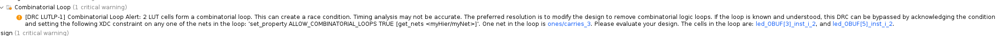

# Loops are fun until they aren't

I expect you're here because you've seen this image:



... or can't run `test.py` to verify that your logic is working correctly. Let's get this figured out.

There are two right ways to implement a circuit like this, but one of them is a little less right than the others. What on earth do I mean by this?

When we were investigating the need for the end-around carry/borrow in the Ones Compliment section, I mentioned

> end-around problem causes absolute havoc with computer systems and makes them significantly more slow than they would otherwise be.

Now, that's deliciously vague, but let's expand on it. When we look at the following Verilog code, what do we see?

```verilog
module full_adder(
    input A, B, Cin,
    output Y, Cout
);
    wire Sum;
    assign Sum = A ^ B;
    assign Y = Sum ^ Cin;
    assign Cout = (Sum & Cin) | (A & B);
    
endmodule

module top(
    input [3:0] sw,
    output [1:0] led
);

    wire carry;

    full_adder lsb(
        .A(sw[0]),
        .B(sw[2]),
        .Y(led[0]),
        .Cout(carry)
    );
    
    full_adder msb(
        .A(sw[1]),
        .B(sw[3]),
        .Y(led[1]),
        .Cin(carry)
    );

endmodule
```

Well, obviously this is an implementation of a two bit adder lifted from week 4. However, there's quite a lot more to this than meets the eye. The `Y` component of `msb` depends on the `carry` signal coming from the `Cout` signal of `lsb`. That means, to put an extremely long story I hope to get in to later short, `msb` can't be stable and know its output until `lsb` is.

We can make this a **lot** worse, if we end-around carry:

```verilog
// full adder omitted for brevity
module top(
    input [3:0] sw,
    output [1:0] led
);

    wire carry;
    wire nuke;

    full_adder lsb(
        .A(sw[0]),
        .B(sw[2]),
        .Y(led[0]),
        .Cin(nuke),
        .Cout(carry)
    );
    
    full_adder msb(
        .A(sw[1]),
        .B(sw[3]),
        .Y(led[1]),
        .Cin(carry),
        .Cout(nuke)
    );

endmodule
```

Well, now we can see that `msb` depends on the output of `lsb` via `carry`. But... `lsb` depends on `msb` via the `nuke` wire. How is this supposed to resolve? The Verilog compiler in Vivado is seeing this too (and so is the poor simulation engine of Icarus Verilog if you're using `test.py`) and is trying to tell you that you might have some pain headed your way if the implementations of your logic won't ever stabilize. Circuits like this might become what are called *astable multivibrators*, aka **clocks**. They will just vibrate until the end of time when given power.

However, luckily for our case, we know that this infinite loop is *never* possible with our adder circuits. Let's examine the worst case scenario to prove it out:

```txt
 10
+11
==>
1 + 0 = 1
1 + 1 = 0, carry out
that carry out loops around:
1 + 1 = 0, carry out
0 + 1 = 1, no carry
loop ends, result is:

10
```

No matter what combination of inputs we use, the carry will eventually land on a zero and end the chain of pain. However, this looped combinatorial logic is still an extremely bad habit to get into. So... how do we break it on situations where we are certain we won't have an endless loop? How can we demonstrate to the Verilog synthesis engines that we know what we are doing?

Well, in this case, we can break things down. Really, we have two additions happening here. The initial `A + B`, then *if* there is a carry overflow from that, we want to do `(A + B) + 1`. Therefore, we can do the following:

```verilog
// full adder omitted for brevity
module top(
    input [3:0] sw,
    output [1:0] led
);

    wire [1:0] APlusB;
    wire carry;
    wire around;

    wire second_carry;

    // First addition
    full_adder lsb_inter(
        .A(sw[0]),
        .B(sw[2]),
        .Y(APlusB[0]),
        .Cin(1'b0), // Fix to zero
        .Cout(carry)
    );
    
    full_adder msb_inter(
        .A(sw[1]),
        .B(sw[3]),
        .Y(APlusB[1]),
        .Cin(carry),
        .Cout(around)
    );

    // Second addition
    full_adder lsb(
        .A(APlusB[0]), // Adding LSB of (A + B)
        .B(1'b0), // We are adding 0, with the optional carry:
        .Y(Y[0]), // This is now the real summation
        .Cin(around), // Fix to zero
        .Cout(second_carry) // We still need to carry to second
        // bit of second addition
    );
    
    full_adder msb(
        .A(APlusB[1]),
        .B(1'b0),
        .Y(Y[1]),
        .Cin(second_carry),
        // no carry out!
    );

endmodule
```

However, now we can see a full *four element long* chain of dependence from the first summation all the way out to the final MSB of the second addition. This, when coupled with the speed of light and gate delays/logic delays/propagation delays, etc. -- this circuit is slow.

Implement it like the above example, though, and you will at least prove to Vivado and your TA/Lab Professor that you understand loops in Combinatorial logic.
